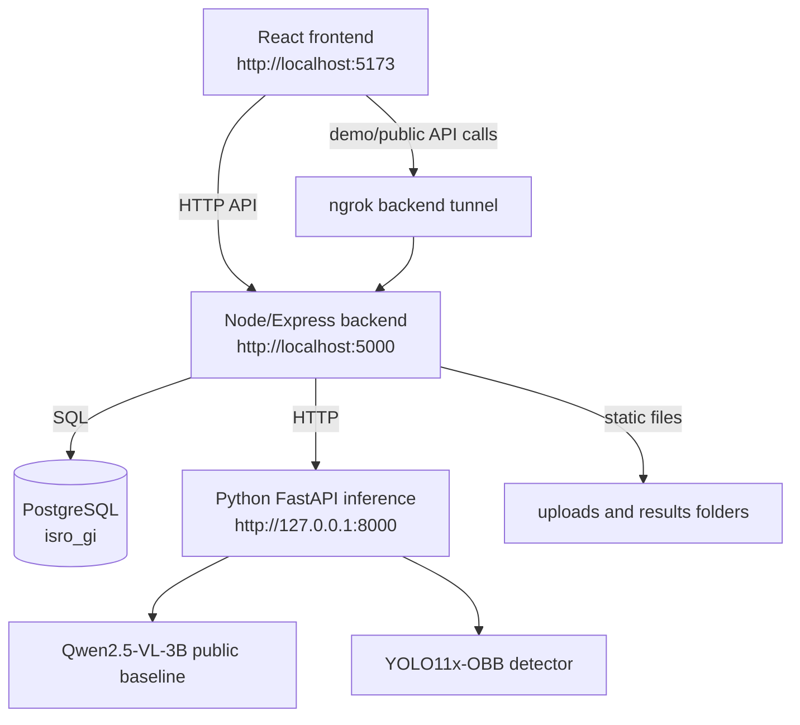

# SatQuery AI Project Report

Updated: 2026-09-21

## 1. Project overview

SatQuery AI is a multimodal satellite-image analysis web application. It lets a user register, log in, upload a satellite image, generate a caption, ask visual questions, request object counts, perform visual grounding, review chat history, and download a PDF analysis report. The application is designed around a web frontend, a Node/Express API server, PostgreSQL persistence, and a Python FastAPI inference service. The current codebase has also been pushed to the GitHub repository `https://github.com/Harsh-P-Shukla/SatQueryAI.git`, and the backend is configured for public access through an ngrok tunnel during demo/deployment runs.

The current runnable local version uses a public baseline model profile:

- Qwen/Qwen2.5-VL-3B-Instruct for captioning and visual question answering.
- YOLO11x-OBB for oriented-object detection and grounding.
- PostgreSQL for users, chats, messages, metadata, and inference output records.
- Local filesystem storage for uploaded images and generated results.
- ngrok exposure for the Node backend so the local API can be reached from the frontend/demo environment.

The original custom fine-tuned artifacts referenced by the repository were not fully available from Git LFS, so the public model profile was selected and verified for local execution.

## 2. Problem statement

Satellite-image interpretation usually requires specialized tools and domain expertise. SatQuery AI reduces that barrier by allowing users to interact with imagery through natural-language workflows:

- “Describe this satellite image.”
- “How many aircraft are visible?”
- “Is there an airport in the image?”
- “Highlight the planes.”
- “Show my previous image-analysis conversations.”

The goal is to provide a practical prototype for remote-sensing visual question answering, visual grounding, and explainable image-analysis workflows.

## 3. Key capabilities

### User and session management

- User registration through email and password.
- Login with bcrypt password verification.
- PostgreSQL-backed user persistence.
- Chat sessions connected to uploaded images and user accounts.

### Image upload and retrieval

- Upload route using Multer.
- Uploaded images stored under the backend uploads directory.
- Upload URLs served through the backend static route.
- Generated result images served from the backend results directory.

### Multimodal analysis

- Captioning endpoint for natural-language scene description.
- Semantic VQA endpoint for open-ended questions.
- Binary VQA endpoint for yes/no style questions.
- Numeric VQA endpoint for count-style questions.
- Visual grounding endpoint that returns generated annotated images.

### Report generation

- Backend can generate a PDF report for a chat.
- Report includes image metadata, caption, stored questions, answers, and generated artifacts where available.

### Deployment and repository status

- Whole codebase is connected to the GitHub remote repository: `https://github.com/Harsh-P-Shukla/SatQueryAI.git`.
- Current local branch: `main`.
- Latest local commit checked while updating this report: `8e0ab12 Initial project commit`.
- Git working tree was clean before this report edit.
- Backend public URL is configured through ngrok in root `config.js`.
- Frontend remains a Vite development app on localhost and calls the configured backend URL.

### Local development UI

- React/Vite frontend.
- Minimal animated Indian-space visual theme.
- Aurora background, tricolor current effect, star field, and orbiting satellite motif.
- Localhost configuration for frontend, backend, and inference services.

## 4. System architecture



The frontend communicates only with the Node backend. For local-only runs, that backend can be reached at `http://localhost:5000`. For demo/deployment runs, the same backend is exposed through ngrok and referenced from `config.js`. The backend owns database access, file uploads, static result serving, chat persistence, PDF report generation, and orchestration of the Python inference service. The Python service owns model loading and GPU/CPU inference.

## 5. Technology stack

### Frontend

- React
- Vite
- Tailwind CSS
- Radix UI primitives
- Framer Motion / motion
- GSAP
- Axios
- Lucide React icons

### Backend

- Node.js
- Express
- PostgreSQL client `pg`
- Multer
- Axios / node-fetch
- bcrypt
- PDFKit

### Python inference

- Python 3.11 isolated virtual environment
- FastAPI
- Uvicorn
- PyTorch with CUDA support on this machine
- Transformers
- Accelerate
- PEFT
- bitsandbytes
- Ultralytics
- qwen-vl-utils
- Pillow
- scikit-learn

### Database

- PostgreSQL 18 on Windows
- Database name: `isro_gi`
- Tables: `users`, `chats`, `messages`

## 6. Database design

### users

Stores user profile and login data.

```sql
CREATE TABLE users (
  id SERIAL PRIMARY KEY,
  name VARCHAR(100),
  email VARCHAR(100) UNIQUE NOT NULL,
  password VARCHAR(100) NOT NULL
);
```

### chats

Stores one image-analysis session per uploaded image.

```sql
CREATE TABLE chats (
  id SERIAL PRIMARY KEY,
  user_id INTEGER REFERENCES users(id) ON DELETE CASCADE,
  image_url TEXT NOT NULL,
  title TEXT,
  caption TEXT DEFAULT NULL,
  img_type TEXT,
  merged_polys JSONB,
  merged_cls JSONB,
  merged_source JSONB,
  updated_at TIMESTAMP DEFAULT CURRENT_TIMESTAMP,
  created_at TIMESTAMP DEFAULT CURRENT_TIMESTAMP
);
```

### messages

Stores question-answer records connected to a chat.

```sql
CREATE TABLE messages (
  id SERIAL PRIMARY KEY,
  chat_id INTEGER REFERENCES chats(id) ON DELETE CASCADE,
  query TEXT NOT NULL,
  text_answer TEXT,
  generated_image TEXT,
  created_at TIMESTAMP DEFAULT CURRENT_TIMESTAMP
);
```

Verified behavior:

- Unique user email constraint works.
- Chat records are linked to users.
- Messages are linked to chats.
- Foreign-key cascade behavior works.
- JSONB columns store detection polygons/classes/source metadata.

## 7. API inventory

### Backend API

Base URL: `http://localhost:5000`

| Method | Route | Purpose |
| --- | --- | --- |
| GET | `/api/health` | Backend and database health check |
| GET | `/api/model-info` | Active inference mode metadata |
| POST | `/api/auth/signup` | Register a user |
| POST | `/api/auth/login` | Log in a user |
| POST | `/api/upload` | Upload an image |
| GET | `/api/uploads/:filename` | Retrieve uploaded image |
| GET | `/api/results/:filename` | Retrieve generated result artifact |
| POST | `/api/chat/new` | Create a chat session for an uploaded image |
| GET | `/api/chat/user/:userId` | List user chats |
| GET | `/api/chat/:chatId/messages` | List messages for a chat |
| DELETE | `/api/chat/:chatId` | Delete a chat |
| GET | `/api/chat/:chatId/report` | Download PDF analysis report |
| POST | `/api/query/caption` | Generate image caption |
| POST | `/api/query/vqa` | Run semantic, binary, or numeric VQA |
| POST | `/api/query/grounding` | Generate grounded image result |
| POST | `/api/query/evaluate` | Partial orchestrated benchmark/evaluation flow |

### Python inference API

Base URL: `http://127.0.0.1:8000`

| Method | Route | Purpose |
| --- | --- | --- |
| GET | `/health` | Inference service health and model metadata |
| POST | `/upload` | Run image preprocessing and object detection |
| POST | `/caption` | Generate caption |
| POST | `/grounding` | Generate visual grounding output |
| POST | `/binary` | Binary VQA |
| POST | `/numeric_evaluate` | Numeric count evaluation |
| POST | `/numeric_chat` | Numeric chat answer |
| POST | `/semantic` | Open-ended semantic VQA |

## 8. Configuration and deployment

Root `config.js` currently keeps the frontend and model service local while exposing the backend through ngrok:

```js
export const translateLink = "http://localhost:5001";
export const frontendLink = "http://localhost:5173";
export const modelLink = "http://localhost:8000";
export const backendLink = "https://dba7-2401-4900-ae4a-19d3-6501-ba85-7865-4aa5.ngrok-free.app";
```

The ngrok URL is used as the public backend base URL for uploaded-image links, generated-result links, and frontend API requests. Because ngrok URLs can rotate unless a reserved domain is used, this value should be refreshed in `config.js` whenever a new tunnel is started.

For purely local development without ngrok, set:

```js
export const backendLink = "http://localhost:5000";
```

Backend environment variables are stored in `backend/.env`, which must not be committed. The example file documents the required keys:

```env
PGHOST=localhost
PGPORT=5432
PGDATABASE=isro_gi
PGUSER=
PGPASSWORD=

SATQUERY_MODEL_MODE=public
SATQUERY_BASE_MODEL=Qwen/Qwen2.5-VL-3B-Instruct
SATQUERY_MAX_PIXELS=401408
SATQUERY_YOLO_DEVICE=cpu
```

For compatibility with earlier local setup, the backend still accepts pre-rename model environment variables, but new setup should use `SATQUERY_*`.

## 9. Model setup

### Public baseline profile

The verified local profile uses:

- `Qwen/Qwen2.5-VL-3B-Instruct`
- Model revision: `66285546d2b821cf421d4f5eb2576359d3770cd3`
- YOLO weights: `backend/.cache/models/yolo11x-obb.pt`
- YOLO SHA256: `1461342db1ce0f35c755278303febd1174604ccc375110076fa0ac155231b6a0`

The Qwen snapshot is stored in the local Hugging Face cache under `backend/.cache/huggingface`. YOLO weights are stored under `backend/.cache/models`.

### Original custom model profile

Original-mode support remains in source, but it is not verified because the required custom artifacts were unavailable from Git LFS:

- Custom YOLO / DIOR weights.
- Caption adapter weights.
- VQA adapter weights.

The public baseline does not recreate those fine-tuned adapters. It is suitable for a working demo and local development, but the exact competition/training behavior of the original custom model cannot be claimed without the missing weights.

## 10. Hardware and runtime observations

The machine has an NVIDIA GPU available. The verified setup uses:

- Qwen on GPU with 4-bit NF4 loading through bitsandbytes.
- YOLO on CPU to preserve GPU memory for Qwen.
- `SATQUERY_MAX_PIXELS=401408` to reduce visual-token memory pressure.

Expected limitations:

- First inference call is slower because models must warm up.
- Caption quality depends on the public baseline and may be less specialized than a fine-tuned remote-sensing model.
- CPU YOLO is slower but leaves GPU memory for the VLM.

## 11. Setup and run sequence

Open separate terminals from the project root.

### Terminal 1: PostgreSQL

Make sure the PostgreSQL Windows service is running. The verified service name was `postgresql-x64-18`.

### Terminal 2: Python inference service

```powershell
cd <project-root>
.\backend\start-inference.ps1
```

Expected URL:

```text
http://127.0.0.1:8000/health
```

### Terminal 3: Node backend

```powershell
cd <project-root>
npm run start --prefix backend
```

Expected URL:

```text
http://localhost:5000/api/health
```

### Terminal 3b: ngrok backend tunnel for demo/deployment

After the backend is running on port 5000, expose it through ngrok:

```powershell
ngrok http 5000
```

Copy the generated HTTPS forwarding URL into `backendLink` in root `config.js`, then restart the frontend if it is already running. The current checked configuration uses:

```text
https://dba7-2401-4900-ae4a-19d3-6501-ba85-7865-4aa5.ngrok-free.app
```

### Terminal 4: React frontend

```powershell
cd <project-root>
npm run dev --prefix frontend
```

Expected URL:

```text
http://localhost:5173
```

## 12. Verification performed

The setup was verified with:

- PostgreSQL service availability.
- Database creation and schema creation.
- Database connection check.
- Insert/select tests.
- Foreign-key and cascade behavior checks.
- Backend health check.
- Auth signup and login.
- Image upload.
- Chat creation.
- Captioning.
- Semantic VQA.
- Binary VQA.
- Numeric VQA.
- Visual grounding.
- Generated image retrieval.
- Message persistence.
- PDF report generation.
- Frontend production build.
- Browser loading at `http://localhost:5173`.
- Git remote configuration for `origin` pointing to `https://github.com/Harsh-P-Shukla/SatQueryAI.git`.
- ngrok backend base URL present in root `config.js`.

The full backend smoke test passes through:

```powershell
npm run test:e2e --prefix backend
```

## 13. UI design update

The frontend has been updated with a minimal Indian-space visual style:

- Dark orbital background.
- Animated aurora effect.
- Tricolor energy current.
- Star field.
- Orbit rings.
- Satellite motif.
- Updated brand name: SatQuery AI.

The interface remains a local React/Vite app and preserves the existing user flows.

## 14. Translation service status

The project configuration reserves `http://localhost:5001` for a translation service, but the inspected repository does not contain a complete local translation service implementation. The core application functions without it for the verified image-analysis workflows. If translation is required later, a real service implementation or API-backed translator must be added and configured with legitimate credentials if needed.

## 15. Known limitations

- Public Qwen baseline may produce imperfect satellite captions.
- Original custom fine-tuned behavior cannot be reproduced without missing adapter and detector weights.
- SAR/IR-specific adapters are not available in the current verified setup.
- Translation service is not implemented locally.
- The application currently handles the verified single-image workflow. Radar fusion and temporal change detection from the proposal deck would require additional upload flows, model integration, training artifacts, and validation.

## 16. Security and secrets

- Database credentials are stored only in `backend/.env`.
- `.env` files are ignored by Git.
- Model caches and virtual environments are ignored by Git.
- Uploads and generated results are ignored by Git.
- No fake credentials or placeholder secrets are hardcoded into the application.
- The ngrok URL is a public routing endpoint, not a secret. If it changes, update `config.js`; if a stable deployment is required, use a reserved ngrok domain or a production host.

## 17. Source control status

The codebase is configured with the following Git remote:

```text
origin  https://github.com/Harsh-P-Shukla/SatQueryAI.git
```

Current repository status at the time of this report update:

- Branch: `main`.
- Latest local commit before the report update: `8e0ab12 Initial project commit`.
- Remote fetch/push URL: `https://github.com/Harsh-P-Shukla/SatQueryAI.git`.
- The source tree is prepared for collaboration through GitHub while local-only assets such as `.env`, caches, uploaded files, generated reports, and virtual environments remain excluded from version control.

## 18. Suggested future improvements

1. Add a complete translation microservice or remove the translation route from UI flows if not needed.
2. Add authenticated session tokens instead of relying only on returned user records.
3. Add upload size/type validation with clear user-facing messages.
4. Add progress indicators for long-running inference.
5. Add a model-status panel that reports warm/cold model state.
6. Add optional GPU/CPU mode switching through documented environment variables.
7. Add test fixtures for multiple satellite scenes.
8. Add support for temporal change detection when matching datasets and weights are available.
9. Add a structured evaluation dashboard for benchmark images and QA pairs.
10. Add a stable public deployment configuration instead of relying on a rotating ngrok forwarding URL.
11. Package the local setup with a single launcher script after all services are finalized.

## 19. Conclusion

SatQuery AI is now configured as a runnable multimodal satellite-analysis application on Windows, with the complete codebase connected to the GitHub repository at `https://github.com/Harsh-P-Shukla/SatQueryAI.git`. The verified setup uses PostgreSQL, Node/Express, React/Vite, FastAPI, Qwen2.5-VL, and YOLO11x-OBB. Core workflows are operational: user authentication, upload, chat creation, captioning, VQA, grounding, chat history, persistence, and report generation. The latest configuration also supports ngrok-based backend exposure for demo/deployment access while retaining the local inference and database services.
